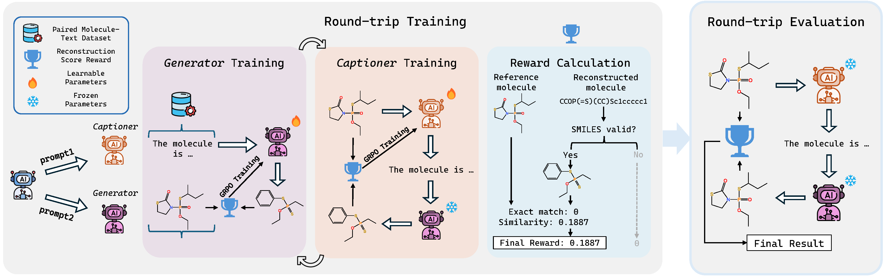

[**English**](README.md) | [**中文**](README.zh-CN.md)

# RTMol: Rethinking Molecule-text Alignment in a Round-trip View

[]()
[]()

**附录**：[附录](assets/Appendix.pdf)

---

### 摘要

将分子序列表示（如SMILES）与文本描述对齐，对于药物发现、材料设计和化学文献自动分析等应用至关重要。现有的方法通常将分子描述（molecule-to-text）和基于文本的分子设计（text-to-molecule）视为独立任务，这导致了三个关键限制：

1. **错误的指标：** 传统的指标（如BLEU）优先考虑语言流畅性，而忽视了化学的准确性 [cite: 9]。
2. **低质量的数据集：** 训练数据经常包含化学上模糊或不完整的描述。
3. **缺乏双向映射：** 对生成方向的独立优化导致了双向的不一致性。

为了解决这些问题，我们提出了 **RTMol**，这是一个双向对齐框架，通过自监督的**轮转学习（round-trip learning）**来统一分子描述和文本到SMILES的生成 。实验表明，RTMol 在各种 LLM 上的双向对齐性能提升高达 **47%**。

### 框架：轮转对齐（Round-Trip Alignment）

RTMol 的核心思想是利用一个单一的 LLM 充当两个互补的角色：**Captioner**（描述生成器）和 **Generator**（分子生成器）。我们通过一个轮转训练过程来强制实现一致性：



### 代码

**即将推出 (Coming Soon)**

我们正在整理和注释代码库，并将很快发布。敬请期待！

### 如何引用

如果您在研究中发现我们的工作有用，请引用我们的论文：

```bibtex
@inproceedings{}